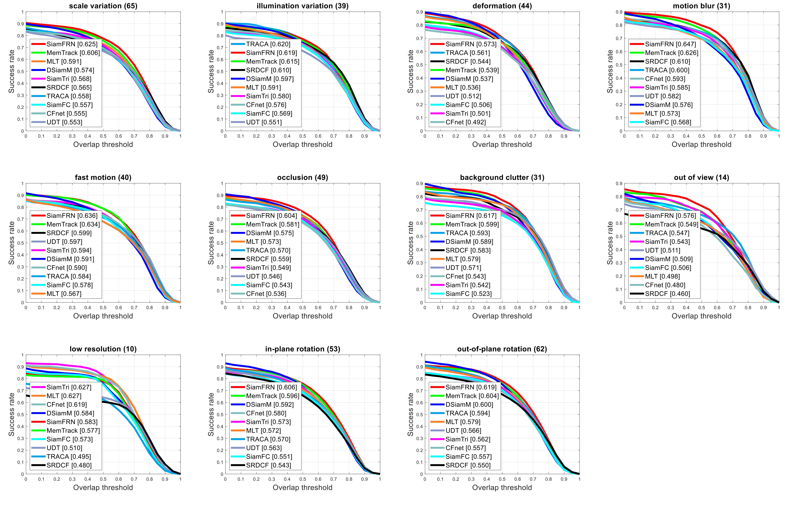

# SiamFRN
## Siamese High-Level Feature Refine Network for Visual Object Tracking

This work proposes a feature refined end-to-end tracking framework with a balanced performance using a high-level feature refine tracking framework. The feature refine module enhances the target feature representation power that allows the network to capture salient information to locate the target. The attention module is employed inside the feature refine mechanism to improve network discrimination power that augments the network ability to track the target in challenging scenarios.

### Comparison with SOTA

  

### Tracker comparison on challenging attributes
#### [Success Plots]

#### [Precision Plots]

### Qualitative performance on challenging sequences

#### The code will release soon for this project....

